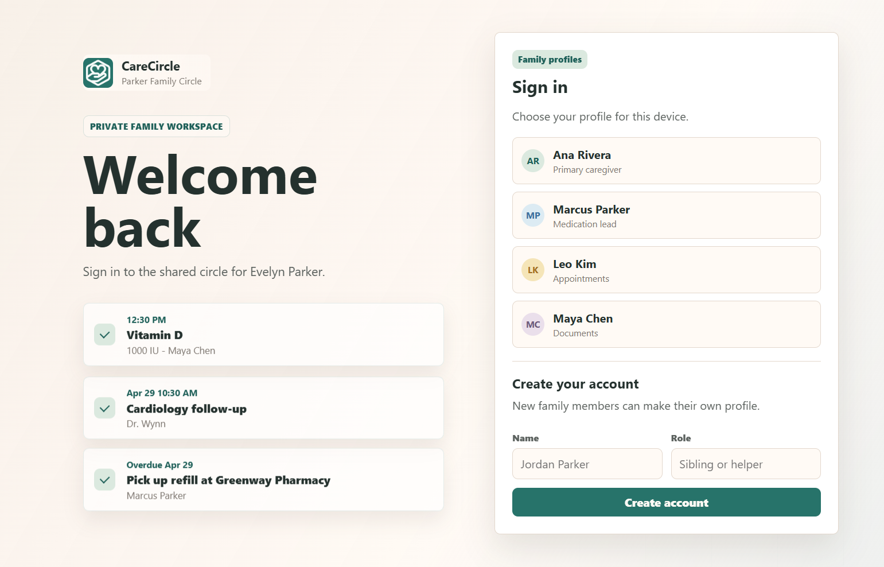
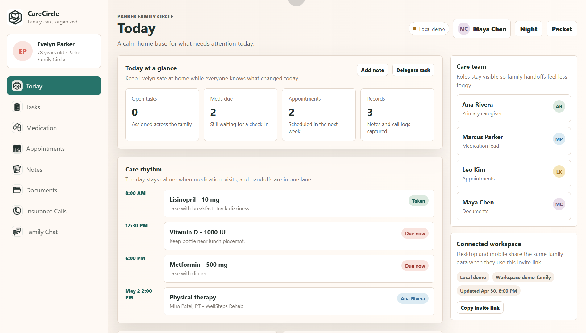
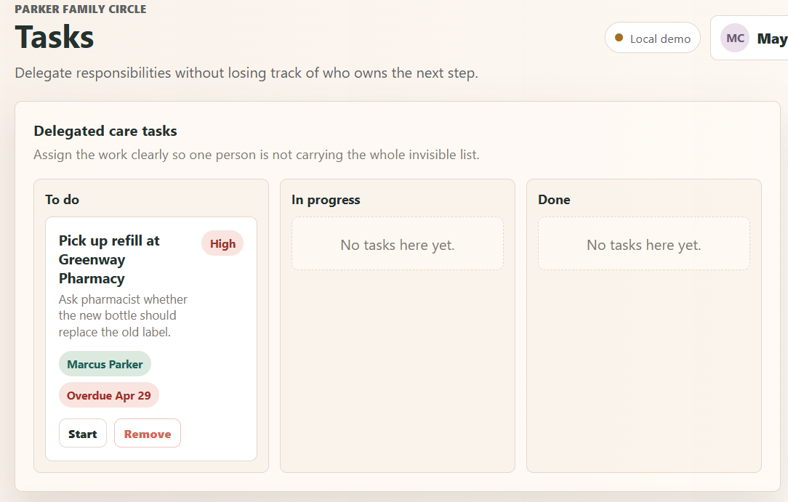
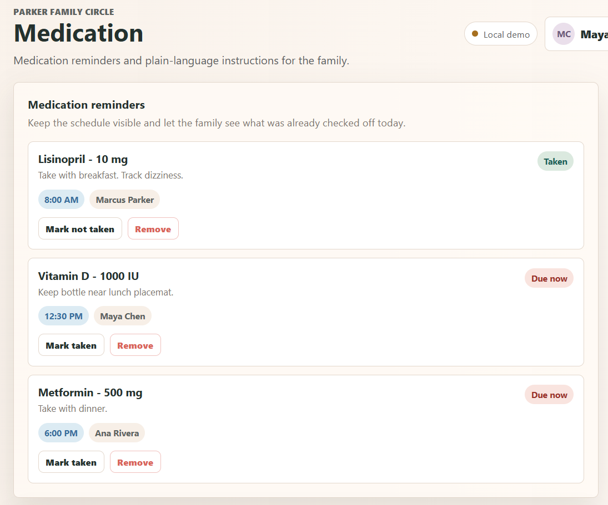
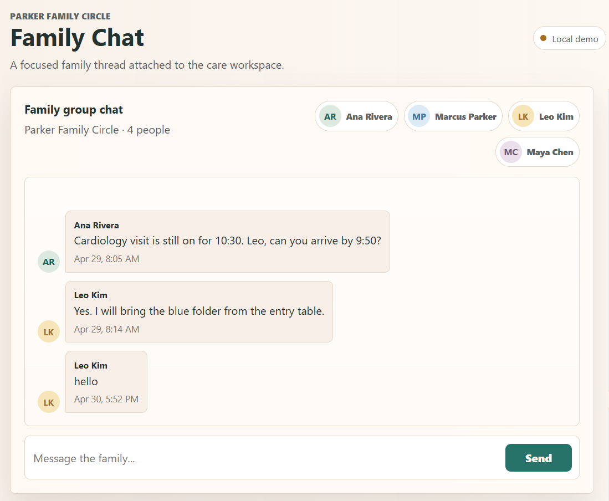
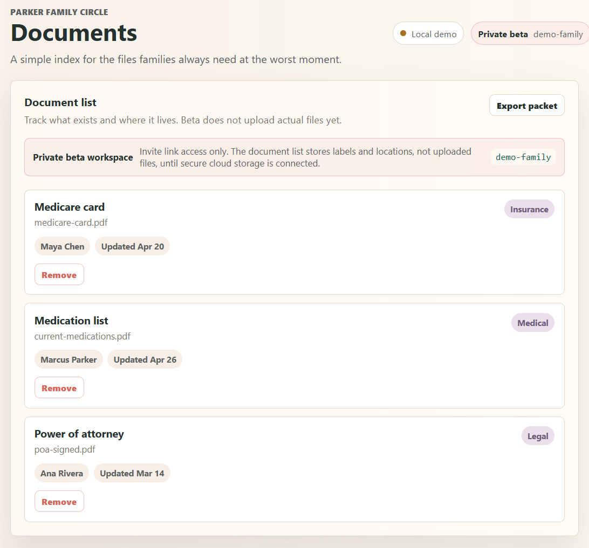
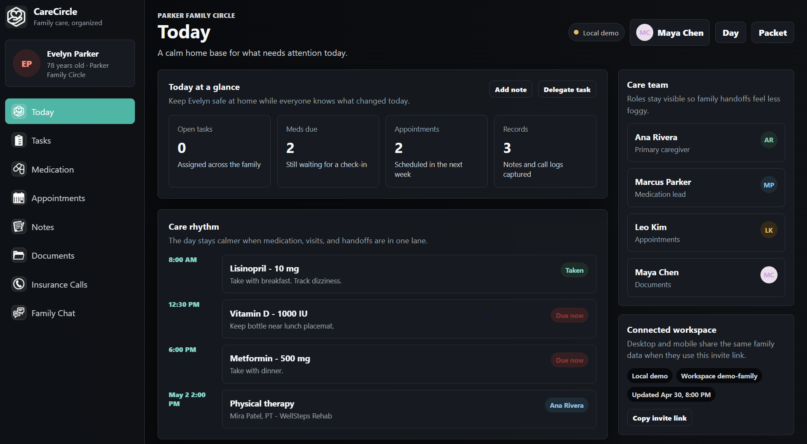
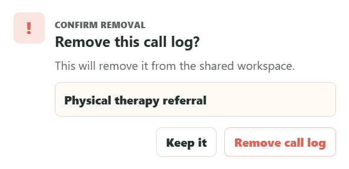

# Care-Circle-Webb-App-Beta
An app to look after the ones that we care for the most. 

CareCircle is a responsive caregiving coordination app for families managing elder care together. It gives relatives one organized place to track tasks, medications, appointments, notes, documents, insurance calls, and family chat.

The project is built as a lightweight PWA-style web app with a warm, mobile-friendly interface and a small Node server for local shared-workspace syncing.

## Why I Built It

Caregiving often becomes scattered across text messages, paper notes, phone calls, and memory. CareCircle explores a calmer interface for keeping the whole family aligned around one shared care record. **I also believe in creating practical apps for everyone no matter what age or race because little by little doing a good thing, no matter how small, goes a long way. ♡**

## Features

- Family dashboard for daily care coordination
- Task delegation with due dates and status updates
- Medication list sorted by time
- Appointment notes, drivers, locations, and providers
- Shared care notes
- Document record list
- Insurance call log
- Family group chat tied to the workspace
- Sign-in/profile picker prototype
- Light and dark mode
- Responsive desktop and mobile layouts
- Care packet PDF export

## Tech Stack

- HTML
- CSS
- JavaScript
- Node.js local server
- Server-sent events for local realtime updates
- PWA manifest and service worker

## Screenshots

| Responsive Sign-In | Daily Care Dashboard |
| --- | --- |
|  |  |

| Task Delegation | Medication Schedule |
| --- | --- |
|  |  |

| Family Group Chat | Document Records And Care Packet |
| --- | --- |
|  |  |

| Mobile Dark Mode | Removal Confirmation |
| --- | --- |
|  |  |

## Project Status

This is a portfolio prototype, not a production medical or clinical system. The current version demonstrates the full product flow and interface. A production version would need real authentication, user permissions, secure cloud storage, and a production database.
